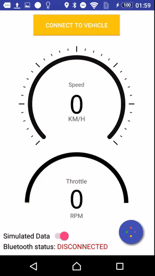
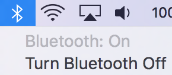

#dynOBD 
------------

####Version:`1.0` Min SDK:`23` Target SDK:`24`

------

&nbsp;&nbsp;&nbsp;&nbsp;&nbsp;&nbsp;&nbsp;&nbsp;&nbsp;&nbsp;&nbsp;&nbsp;

####*Luisa Rojas* &nbsp;&nbsp;&nbsp;&nbsp;&nbsp;&nbsp;&nbsp;&nbsp; *Alexandar Mihaylov*

---------
#About

> **dynOBD** is an android application that keep track of statistics about any given car trip. It uses bluetooth to connect to an [OBDII](https://en.wikipedia.org/wiki/On-board_diagnostics#OBD-II) dongle that is connected seperately to the car's [DLC](https://en.wikipedia.org/wiki/Data_link_connector_(automotive)). Instructions on connecting the dongle to the car can be found [here](http://www.ehow.com/how_2214654_connect-obd2-car.html). Alternatively if there is no access to an OBDII dongle then the user can generate simulated data which is explained in further detail down below. 

----------

#Running dynOBD
###Method 1 - Simulated Data (RANDY README)
* Ensure that the switch at the bottom of the app. is **ON** as shown. 
* Only the datastream is simulated, so you still need to connect to **any** bluetooth device before proceeding
* Turn on the Bluetooth to your computer 
* Pair your phone with you computer
* Launch dynOBD 
* Click the  Button
* Select your computer from the *list of paired devices*
* Click the  Button
* The data will simulate acceleration to about *~100 km/h* and *~2200 RPM* and begin to fluctuate around those ranges. 
* You can proceed to use the app as normal from this point on

-----------

###Method 2 - Real Data
* Connect the Dongle to the Car DLC, for more detailed instructions visit [this page](http://www.ehow.com/how_2214654_connect-obd2-car.html)
* Ensure that the bluetooth is on, there should be a power button and lights indicating that the device is on
* Start your car
* Before launching the app, pair your phone with the OBDII dongle 
* Launch dynOBD 

##Specifics used to test Application
* **Car Make**: 2003 Hyundai Elantra
* **OBDII Protocol**: ISO 14230-4 
* **ISO 14230-4 Supported by**: ELM323, ELM327, ELM327/L
* **OBD Device**: OBD2 ELM327 Bluetooth KW901/KW903 Car Auto Diagnostic Interface Scanner Tool KONNWEI
* **OBD2 Simulator**: [ScanTool 602201 ECUsim 2000 ECU CAN Simulator for OBD-II Development](https://www.amazon.com/ScanTool-602201-ECUsim-Simulator-Development/dp/B008NAH6WE)

##Useful Links:
* [Hyundai OBD II diagnostic interface pinout](http://pinoutsguide.com/CarElectronics/hyundai_obd_2_pinout.shtml)
* [ELM protocol support](https://www.elmelectronics.com/products/ics/obd/)
* [ELM327 AT Commands](https://www.sparkfun.com/datasheets/Widgets/ELM327_AT_Commands.pdf)
* [OBDII Commands](https://en.wikipedia.org/wiki/OBD-II_PIDs)
* [Android Bluetooth](https://developer.android.com/guide/topics/connectivity/bluetooth.html)
* [OBDII Android Tutorial](http://blog.lemberg.co.uk/how-guide-obdii-reader-app-development)
* [Android OBD Reader](https://github.com/pires/android-obd-reader)
* [OBD Sim](http://icculus.org/obdgpslogger/obdsim.html)
* [OBD + GPS application](http://icculus.org/obdgpslogger/)
* [RxJava Github](https://github.com/ReactiveX/RxJava)
* [Awesome Android UI](https://github.com/wasabeef/awesome-android-ui)

##Problems/Fixes
* [Bluetooth Fails to Connect](http://stackoverflow.com/questions/18657427/ioexception-read-failed-socket-might-closed-bluetooth-on-android-4-3/18786701details)
* [Constant output issue](https://github.com/pires/obd-java-api/issues/98)

##APIs Being Used
Name | Description 
-----|----------
[ODBII Java api](https://github.com/pires/obd-java-api) | Handle the data collected by the ODBII diagnostic's system
[Otto - Android Event Bus](http://square.github.io/otto/) | Decouple different parts of yotheur application while still allowing them to communicate efficiently.
[CustomGauge](https://github.com/pkleczko/CustomGauge)   [ColorArcProgressBar](https://github.com/Shinelw/ColorArcProgressBar) | Graphic UI for speed and throttle live data output.
[CircularFloatingActionMenu](https://github.com/oguzbilgener/CircularFloatingActionMenu) | Animated, customizable circular floating menu
[Sweet Alert Dialog](https://github.com/pedant/sweet-alert-dialog)   [DialogPlus](https://github.com/orhanobut/dialogplus) | Dialog animation
[Roads API (Snap to roads)](https://developers.google.com/maps/documentation/roads/intro) | Best-fit road geometry for a given set of GPS coordinates.

##OBD-II PIDs and Java OBD Api
###Control:

Mode | PID(hex) | OBD-Java-Api | Description
-----|----------|--------------|-----------
01 | 21 | DistanceMILOnCommand.java | Distance traveled with malfunction indicator lamp (MIL) on
01 | 31 | DistanceSinceCCCommand.java | Distance traveled since codes cleared
01 | 01 | DtcNumberCommand.java | Monitor status since DTCs cleared. (Includes malfunction indicator lamp (MIL) status and number of DTCs.)
01 | 44 | EquivalentRatioCommand.java | Fuel–Air commanded equivalence ratio
AT | IGN | IgnitionMonitorCommand.java | N/A
01 | 42 | ModuleVoltageCommand.java | Control module voltage
-- | 07 | PendingTroubleCodesCommand.java | Show pending Diagnostic Trouble Codes (detected during current or last driving cycle)
-- | 0A | PermanentTroubleCodesCommand.java | Permanent [Diagnostic Trouble Codes](https://en.wikipedia.org/wiki/On-board_diagnostics#EOBD_fault_codes) (DTCs) (Cleared DTCs)
01 | 0E | TimingAdvanceCommand.java | [Timing advance](https://en.wikipedia.org/wiki/Ignition_timing#Setting_the_ignition_timing)
-- | 03 | TroubleCodesCommand.java | Show stored Diagnostic Trouble Codes
09 | 02 | VinCommand.java |  [Vehicle Identification Number (VIN)](https://en.wikipedia.org/wiki/Vehicle_identification_number)

###Engine:

Mode | PID(hex) | OBD-Java-Api | Description
-----|----------|--------------|-----------
01 | 43 | AbsoluteLoadCommand.java | Absolute load value
01 | 04 | LoadCommand.java | Calculated Engine Load
01 | 10 | MassAirFlowCommand.java | MAF air flow rate
01 | 5C | OilTempCommand.java | Engine oil temperature
AT | 0C | RPMCommand.java | Engine RPM
01 | 1F | RuntimeCommand.java | Run time since engine start
01 | 11 | ThrottlePositionCommand.java | Throttle position

###Fuel:

Mode | PID(hex) | OBD-Java-Api | Description
-----|----------|--------------|-----------
01 | 44 | AirFuelRatioCommand.java | Fuel–Air commanded equivalence ratio
01 | 5E | ConsumptionRateCommand.java | Engine fuel rate
01 | 51 | FindFuelTypeCommand.java | Fuel Type
01 | 2F | FuelLevelCommand.java | Fuel Tank Level Input
-- | -- | FuelTrimCommand.java | N/A
01 | 34 | WidebandAirFuelRatioCommand.java | ? Oxyegen Sensor 1

###Pressure:

Mode | PID(hex) | OBD-Java-Api | Description
-----|----------|--------------|-----------
01 | 33 | BarometricPressureCommand.java | Absolute Barometric Pressure
01 | 0A | FuelPressureCommand.java | Fuel pressure [(gauge pressure)](https://en.wikipedia.org/wiki/Pressure_measurement#Absolute.2C_gauge_and_differential_pressures_-_zero_reference)
01 | 23 | FuelRailPressureCommand.java | [Fuel Rail](https://en.wikipedia.org/wiki/Common_rail) Gauge Pressure (diesel, or gasoline direct injection)
01 | 0B | IntakeManifoldPressureCommand.java | 	Intake manifold absolute pressure

###Temperature:

Mode | PID(hex) | OBD-Java-Api | Description
-----|----------|--------------|-----------
01 | 0F | AirIntakeTemperatureCommand.java | Intake air temperature
01 | 46 | AmbientAirTemperatureCommand.java | Ambient air temperature
01 | 05 | EngineCoolantTemperatureCommand.java | Engine coolant temperature

